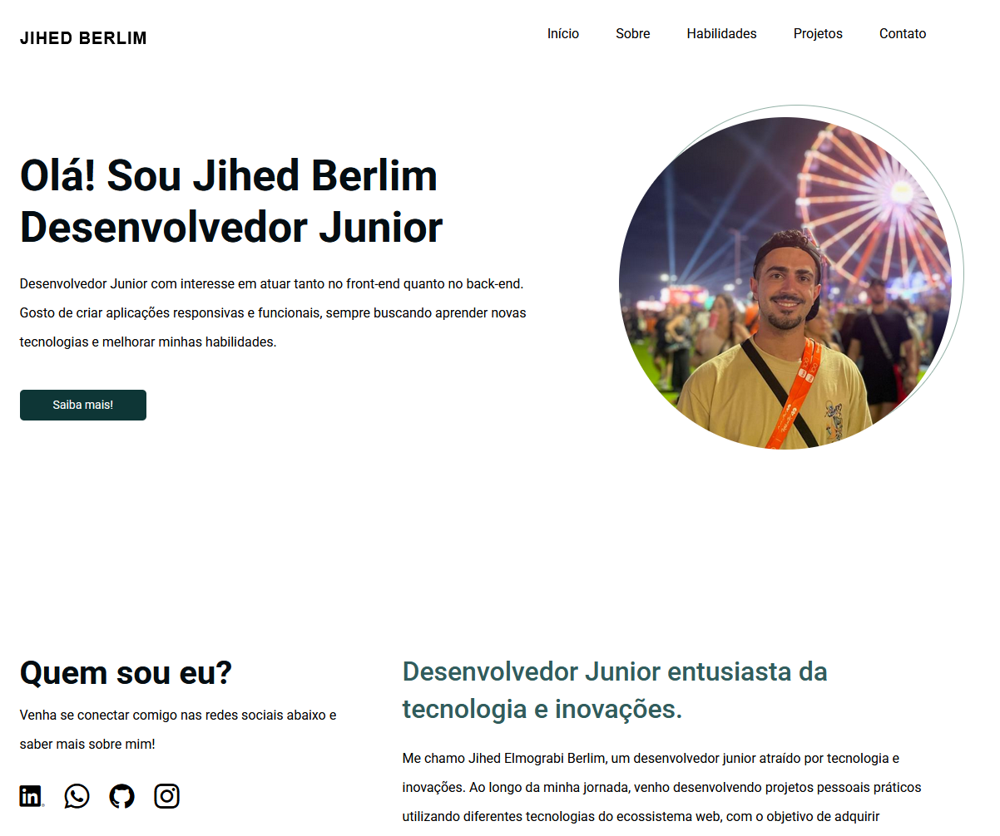

# 🚀 Portfólio - Jihed Berlim

Este é o meu portfólio pessoal desenvolvido com o objetivo de apresentar minhas habilidades, projetos e evolução como desenvolvedor junior.

🔗 Acesse: https://jihedeberlim.vercel.app/

---

## 📸 Preview do projeto

<p align="center">
  
</p>

---

## 📝 Sobre o projeto

Este portfólio funciona como um currículo profissional, apresentando:

- Minhas principais habilidades técnicas (front-end e back-end)  
- Projetos desenvolvidos para estudo e prática
- Formas de contato  

A proposta é demonstrar não apenas conhecimento técnico, mas também organização, design e boas práticas de desenvolvimento.

---

## 🛠️ Tecnologias utilizadas

### 🎨 Front-end
- HTML5  
- CSS3  
- JavaScript  

### 🧰 Ferramentas
- Git & GitHub  
- Vercel (deploy)  

---

## ⚙️ Funcionalidades

- Layout responsivo 
- Navegação fluida  
- Seção de habilidades com carrossel  
- Exibição de projetos  
- Interface minimalista  

---

## 📂 Estrutura do projeto

```bash
/
├── assets/
├── index.html
├── style.css
└── script.js
